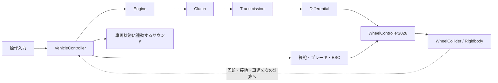

# AimRacing2026

### 加速・減速・旋回の手応えをつくる、GR Yaris 4WDの車両挙動改善

学校で代々引き継がれてきたUnity製レースゲーム「AimRacing」の車両制御を改善した作品です。私の担当は**エンジントルクとサスペンションを中心とした車両挙動**です。発進、変速、ブレーキ、横滑り、衝突後の復帰までをつなげ、幅広いプレイヤーが操作の変化を感じ取れる走行体験を目指しました。

実車の仕組みを参考にしながら、WheelColliderの特性と展示時の操作性に合わせて調整しています。

**[ダウンロード](#ダウンロード起動方法) · [操作方法](#操作方法) · [担当範囲](#担当範囲) · [技術的に工夫した点](#技術的に工夫した点) · [問題と改善](#発生した問題と改善内容) · [主要コード](#特に見てほしいコード) · [検証](#検証と公開範囲)**

## ダウンロード・起動方法

**[Windows版をダウンロード（AimRacing2026.zip）](https://github.com/prashant-rayamajhi/AimRacing2026/releases/download/company-build-2026-10-03/AimRacing2026.zip)** · [リリース詳細](https://github.com/prashant-rayamajhi/AimRacing2026/releases/tag/company-build-2026-10-03)

1. ZIPをダウンロードし、すべて展開します。
2. 展開した`AimRacing2026`フォルダ内の`AimRacing2026.exe`を起動します。
3. タイトルで`↑`を押し、`←`でAT／`→`でMTを選択します。`↑`で確認画面に進み、一度キーを離してから再度`↑`を押して決定します。

Windows 64bit向けです。Unity Editorは不要です。exeだけを移動せず、`AimRacing2026_Data`フォルダやDLLなどの同梱ファイルを一緒に保管してください。HDRPを使用しているため、3D描画に対応したGPUが必要です。

## 操作方法

専用ハンドルがない場合も、キーボードで操作できます。

| 場面 | 操作 | キー |
| --- | --- | --- |
| タイトル | ゲーム開始 | `↑` |
| メニュー | AT／MTを選択 | `←`：AT ／ `→`：MT |
| メニュー | 選択を確認・決定 | `↑`（確認画面が出たら、一度離してもう一度押す） |
| メニュー | 確認画面から選択へ戻る | `↓` |
| 走行中 | アクセル | `↑`を押し続ける |
| 走行中 | ブレーキ | `↓` |
| 走行中 | ハンドル操作 | `←`／`→` |
| MT走行中 | シフトアップ／ダウン | `D`／`A` |
| 走行中 | カメラ切り替え | `Home` |
| ゲーム中 | タイトルへ戻る | `F1` |
| ゲーム中 | 終了 | `Esc` |

初めてプレイする場合は、変速が自動のATからお試しください。発進時に「アクセルペダルを全開にしてください」と表示されたら、キーボードでは`↑`を押し続けます。


## 基本情報

| 項目 | 内容 |
| --- | --- |
| ジャンル | レースゲーム |
| 制作形態 | 学校でのチーム制作・継承開発 |
| 題材 | GR Yaris／4WD |
| 使用エンジン | Unity 6000.3.11f1 |
| 使用言語 | C# |
| 主な使用技術 | Rigidbody、WheelCollider、Unity Input System、FMOD |
| 操作環境 | G923ハンドル・ペダル、パドル／外付けシフト、キーボード入力 |
| 公開内容 | 車両挙動の改善と関連修正を含むC#スクリプト、ReleasesのWindowsプレイ版 |

## 担当範囲

### 車両挙動の改善

- エンジンのトルク特性、ターボ応答、回転制限、エンジンブレーキ
- サスペンション、タイヤの接地、車体姿勢と表示タイヤの調整
- クラッチ、AT／MT変速、発進・停止後の再発進補助
- 四輪駆動の前後トルク配分と走行モードの切り替え
- 速度に応じた操舵、ABS、ESC、Trackモードの旋回補助
- 壁接触時の過剰な反発の抑制、コース復帰時の状態初期化

### 関連する修正

車両入力と変速の接続、回転数・車速・滑りに連動するサウンド制御、メーター表示やゲーム進行との接続も調整しました。

**椅子制御の`ChairController.cs`は担当外のため掲載していません。** FFB、メーター、カメラ、ゲーム進行などの共有ファイルは関連修正を含む参照であり、各システム全体を私が制作したという意味ではありません。車両コードにも継承した基盤が含まれます。

## 技術的に工夫した点

### 1. トルク・慣性・負荷をつなげたエンジン応答

アクセル入力をそのまま一定の駆動力へ変換せず、回転数に応じたトルク、過給の立ち上がり、エンジン抵抗、クラッチから戻る負荷を組み合わせています。

- `EvaluateEngineTorque`で回転数に応じた全負荷トルクを計算し、最大トルクと最大出力の両方で制限します。
- 過給の立ち上がりと抜けに異なる追従速度を使い、急なトルク変化を抑えます。
- 正味トルクを慣性で割って角加速度を求め、物理更新ごとに回転数へ反映します。
- レブリミッターは燃料カット開始と復帰の回転数に差を設け、上限付近で判定が細かく往復することを防ぎます。

回転数、加速、音へ渡す燃焼状態を共通の状態から求めることで、それぞれの反応が独立して食い違わないようにしています。出力上限や回転上限はゲーム向けの調整値を含みます。

主要コード：[`Engine.cs`](Assets/%23Scripts/CarScript/Powertrain/Engine.cs)

### 2. 接地・サスペンション・表示タイヤの整合

サスペンションの硬さだけでなく、車輪の接地点、伸縮量、車体へ力を加える位置、表示タイヤの姿勢を合わせて扱っています。

左右サスペンションの圧縮差からアンチロール力を計算し、接地している車輪の位置へ力を加えます。表示側ではWheelColliderの姿勢とタイヤモデルの回転差を保持し、物理車輪と見た目の向きを合わせています。路面へのめり込みには、接地点やモデル形状を使った補正処理を設けています。

また、旧WheelController2024と現行制御が同時に物理更新しないよう、車両初期化時に旧処理を停止します。継承開発で起こりやすい「別の場所から同じ車体へ力が加わる」問題にも対処しています。

主要コード：[`WheelController2026.cs`](Assets/%23Scripts/CarScript/Wheels/WheelController2026.cs)、[`VehicleController.cs`](Assets/%23Scripts/CarScript/Vehicle/VehicleController.cs)

### 3. 変速の受付と駆動の接続を分ける

ギアを変更できる条件と、エンジンの力をタイヤへ伝える条件を分離しています。

ATでは、停止中の「前進1速 ↔ N ↔ R」の選択と走行中の自動変速を区別します。停止判定には車体速度の大きさを使い、後退や横滑り中の入力を誤って停止中と判定しないようにしています。Nを選んだ後も、その選択状態を保持します。

MTの発進補助では、回転数を直接引き上げるのではなく、目標回転へ立ち上げるためのトルクを残すようクラッチ負荷を制限します。発進時の回転上昇と駆動の接続を、同じ駆動系の計算の中で扱う設計です。

主要コード：[`Transmission.cs`](Assets/%23Scripts/CarScript/Powertrain/Transmission.cs)、[`Clutch.cs`](Assets/%23Scripts/CarScript/Powertrain/Clutch.cs)、[`GearShift.cs`](Assets/%23Scripts/CarScript/Vehicle/GearShift.cs)

### 4. 操作を支えるABS・ESCと走行モード

加速中の空転と制動中のロックを区別し、駆動力制限とABSで別々に処理しています。ESCは車体のスリップ角と、目標・実際のヨーレートの差から介入量を求めます。

曲がり不足と回りすぎを区別して制動する車輪を選び、介入の開始と解除には異なる追従速度を設定します。旋回開始直後の微小な回転を逆旋回と誤判定しないよう、判定幅も設けています。

Normal・Sport・Trackでは前後トルク配分に加えて、旋回補助や滑りの許容幅を切り替えます。モード変更は補間し、Trackではカウンターステアを曲がり不足と誤認して過剰に制動しないよう調整しています。

主要コード：[`StabilityAssist.cs`](Assets/%23Scripts/CarScript/Vehicle/StabilityAssist.cs)、[`Differential.DriveModes.cs`](Assets/%23Scripts/CarScript/Powertrain/Differential.DriveModes.cs)、[`WheelController2026.DriveGrip.cs`](Assets/%23Scripts/CarScript/Wheels/WheelController2026.DriveGrip.cs)

### 5. 車両状態とサウンドを連携させる

回転数だけでなく、アクセル、変速、レブリミッター、車速、タイヤの滑りをサウンド制御へ渡しています。風音には車速の絶対値を使い、後退にも対応します。音量の追従には時間に基づく補間を使い、急な入り切りを抑えています。

担当したのは車両状態と再生条件・パラメーターを結ぶコードの調整です。音源素材やFMODバンクの制作とは区別しています。

主要コード：[`DriveSound.cs`](Assets/%23Scripts/Sound/2024/DriveSound.cs)、[`TireSound.cs`](Assets/%23Scripts/Sound/2024/TireSound.cs)、[`WindSound.cs`](Assets/%23Scripts/Sound/2024/WindSound.cs)

## 発生した問題と改善内容

| 問題 | 着目した原因・条件 | 実装した対応 |
| --- | --- | --- |
| コース復帰後、再発進まで時間がかかる | 車体位置を戻しても、車輪・クラッチ・変速・エンジンに復帰前の状態が残る | `ResetAfterCourseRecovery`で車体速度と駆動系をまとめて初期化し、再発進補助へ接続 |
| MTの発進時に回転数が上がりにくい | クラッチ負荷が回転の立ち上がりを妨げる | 発進時に必要な加速トルクを残す負荷制限を追加 |
| タイヤの表示と接地・車体位置が合わない | 物理車輪、表示モデル、旧車輪処理の整合が必要 | 表示姿勢の補正、接地・めり込み補正、旧物理更新の停止を実装 |
| 旋回開始時にESCが不自然に介入する | 微小なヨーレートの符号変化を逆旋回として扱う | 判定幅を設け、曲がり不足と回りすぎで制動輪を選択 |
| 壁接触後に反対側へ大きく跳ね返る | 接触面から離れる速度や角速度が過剰になる | 接触法線方向の反発速度制限と、横転を抑える補正を実装 |
| 風音の音量設定が反映されない | FMODイベントに存在しない音量パラメーターへ送信していた | イベント本体への音量設定へ変更し、車速連動と滑らかな追従を追加 |

上記は問題に対して実装した対応です。すべての走行条件で解消を確認したという意味ではなく、公開版の検証範囲は末尾に記載しています。

## 車両制御の構成



駆動力と制御の関係を示した概念図です。`VehicleController`が物理更新をまとめ、機構ごとの状態や計算を各クラスへ渡します。

`VehicleController`の補助処理は、`WallCollision`、`StabilityAssist`、`RaceStart`、`GearShift`、`CorneringAssist`などのpartialファイルへ分けています。衝突、発進、変速のどの処理を変更するかを追いやすくしています。これらは同じクラスの一部で、別々のコンポーネントではありません。物理更新は`Drivetrain.cs`、車体のピッチ制御は`BodyMotion.cs`、コース復帰は`VehicleRecovery.cs`に分かれています。

## 特に見てほしいコード

最初は次の順に読むと、車両全体と各機構の関係を追えます。

| 順番 | ファイル | 確認してほしい処理 |
| --- | --- | --- |
| 1 | [VehicleController.cs](Assets/%23Scripts/CarScript/Vehicle/VehicleController.cs) | 車両の参照・状態管理。物理更新は[Drivetrain.cs](Assets/%23Scripts/CarScript/Vehicle/Drivetrain.cs)、復帰処理は[VehicleRecovery.cs](Assets/%23Scripts/CarScript/Vehicle/VehicleRecovery.cs)へ分割 |
| 2 | [Engine.cs](Assets/%23Scripts/CarScript/Powertrain/Engine.cs) | `EngineUpdate`のトルクと慣性による積分、`EvaluateEngineTorque`の出力上限制御 |
| 3 | [WheelController2026.cs](Assets/%23Scripts/CarScript/Wheels/WheelController2026.cs) | 駆動・制動の車輪への反映、`ApplyAntiRollBar`、接地と表示タイヤの整合 |
| 4 | [Clutch.cs](Assets/%23Scripts/CarScript/Powertrain/Clutch.cs) | `ApplyManualLaunchLoadLimit`で発進用トルクを残す計算 |
| 5 | [Transmission.cs](Assets/%23Scripts/CarScript/Powertrain/Transmission.cs) | 自動変速と`RequestAutomaticSelector`による停止中の方向選択 |
| 6 | [StabilityAssist.cs](Assets/%23Scripts/CarScript/Vehicle/StabilityAssist.cs) | `UpdateESC`、`IsESCOversteer`、`SelectESCBrakeWheel`の判断の分離 |
| 7 | [WallCollision.cs](Assets/%23Scripts/CarScript/Vehicle/WallCollision.cs) | `LimitContactRebound`などの接触方向を考慮した反発抑制 |

<details>
<summary>リポジトリ構成を開く</summary>

```text
Assets/#Scripts/
├─ CarScript/
│  ├─ Vehicle/     車両状態・駆動更新・各種補助・復帰
│  ├─ Powertrain/  エンジン・クラッチ・変速・駆動配分・操舵・制動
│  ├─ Wheels/      接地・車輪制御
│  ├─ Physics/     重心・空力・共通定数
│  ├─ Collision/   コースの通過判定
│  ├─ Inspector/   Inspector用の共通処理
│  └─ Legacy/      旧実装の参照
├─ Input/           操作入力
├─ Sound/2024/      車両サウンド
├─ Integration/    メーター・FFB・コース復帰との連携
├─ Camera/         カメラ切り替え
├─ GameManager/    ゲーム進行との連携
├─ UI/             逆走表示
├─ UI_Others/      カウントダウン
└─ Others/         関連修正
```

C#スクリプト52件を収録しています。旧WheelController2024と空のFrontColliderは互換・旧実装の参照です。主な車輪制御はWheelController2026を参照してください。RacingState.csには提出用のデバッグ操作除去が含まれますが、ゲーム進行全体を担当成果とするものではありません。

</details>
